###IT兼职网

暑期实训小项目，没啥限制，所以选了自己比较感兴趣的技术栈：

+ React
+ Redux
+ Ant Desgin
+ Koa
+ Mongodb

运行：

1. 安装并运行mongodb
2. npm i, 安装依赖
3. npm run server, 运行服务端
4. npm run dev, 运行客户端
5. 访问 http://127.0.0.1:8080/

前期功能需求设计：

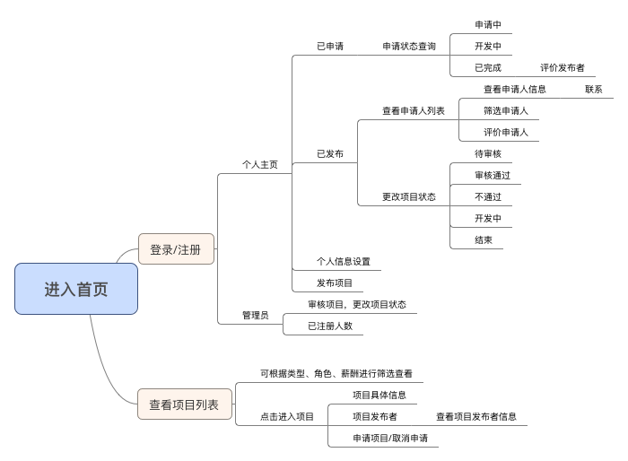

功能模块：

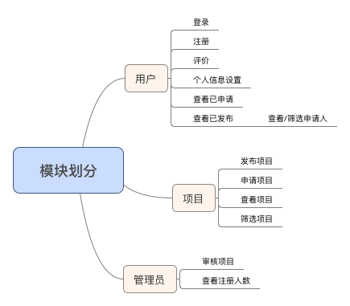

项目运行截图：

/auth/login

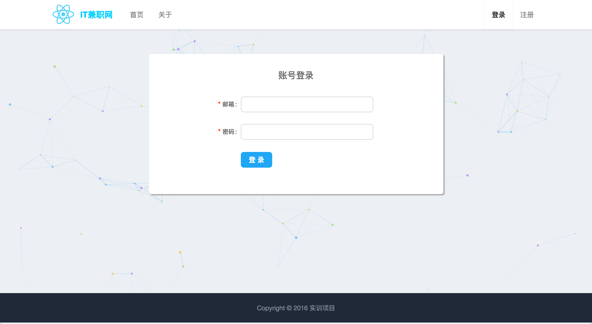

/auth/register

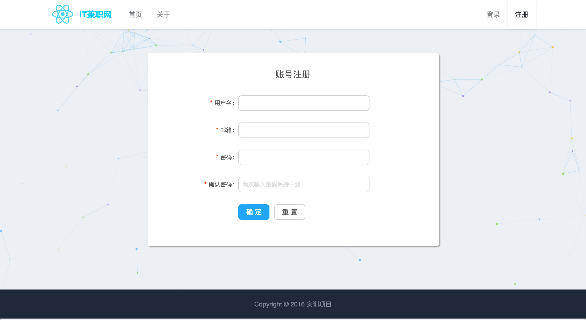

/

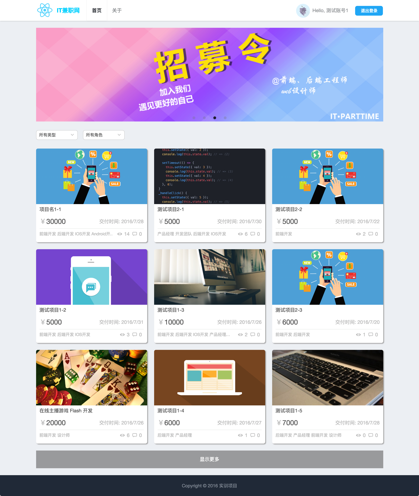

/project/_id

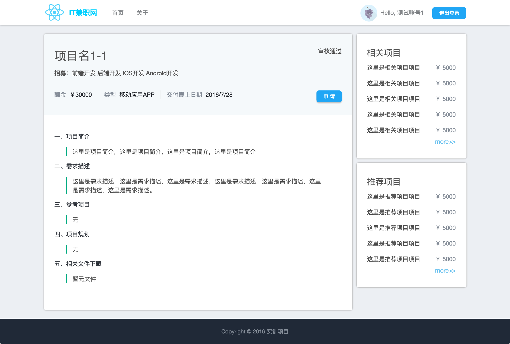

/user/setting

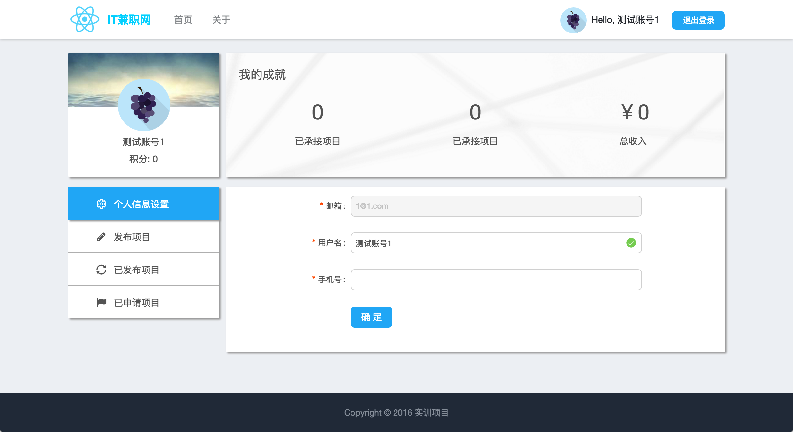

/user/publish

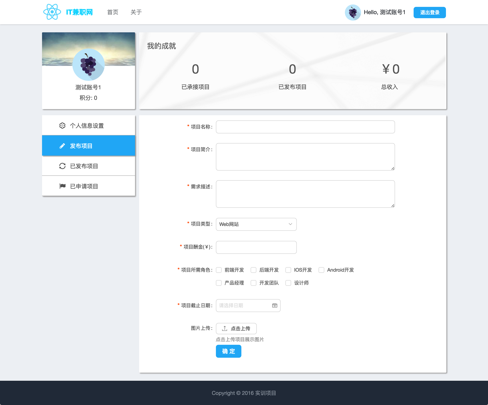

/user/published

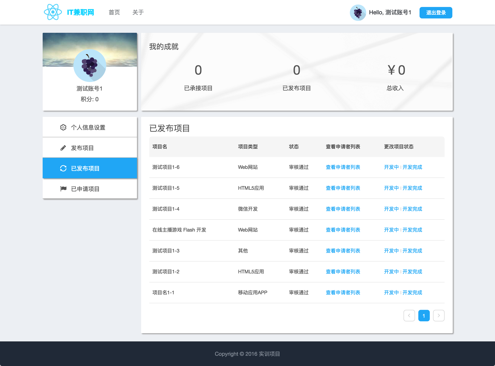

/user/applierList/_id

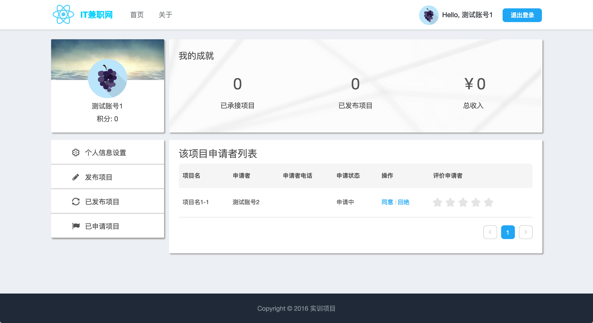

/user/applied

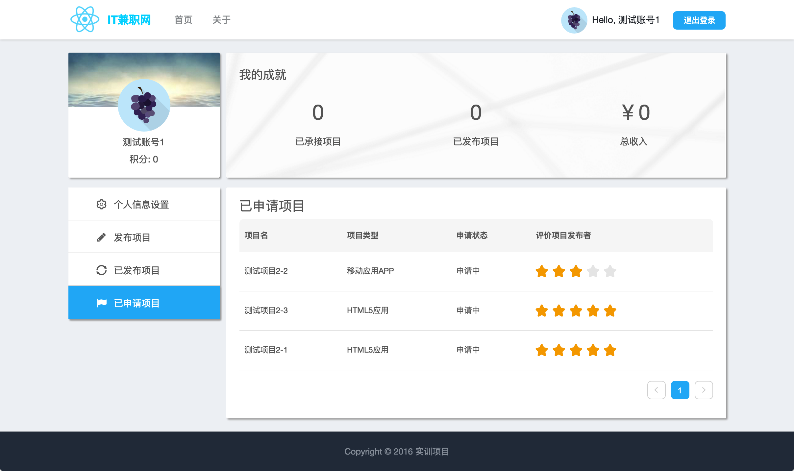

/admin

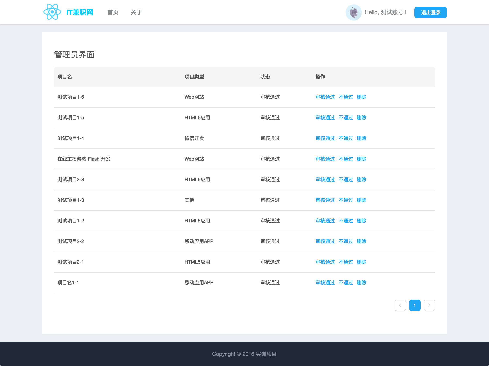

 